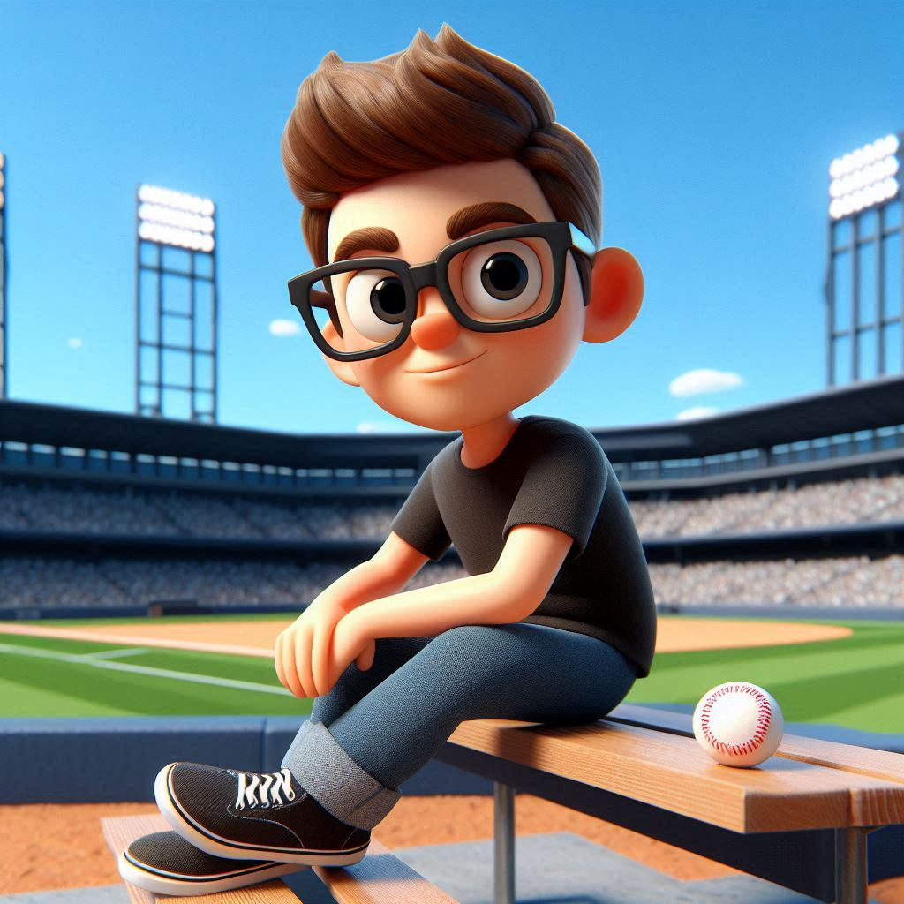

# Imagem do Copilot ;)

## 📒 Descrição
Criação de imagens seguindo uma descrição específica. 

## 🤖 Tecnologias Utilizadas
[Copilot Microsoft](https://copilot.microsoft.com/)

## 🧐 Processo de Criação
Texto para geração da imagem:
```
Crie uma ilustração 3D de um personagem caucasiano animado com óculos sentado casualmente em cima de um banco. O personagem deve usar camiseta preta, cabelos curtos, magro sem barba, segurando uma bola de baseball. Ao fundo da imagem, coloque um campo do new york yakees.
```

## 🚀 Resultados


## 💭 Reflexão (Opcional)
Oportunidade de pesquisar e analisar as ferramentas disponíveis para o caso sugerido.
